# Apple Store Dataset SQL Project

By: Steven Nguyen

## Introduction

#### In this project I will use SQL Lite to explore and analyze data and provide insights to the stakeholder.

## Objective

#### An aspiring developer wants to develop apps on the Apple App Store. He needs data driven insights to decide which app to build. To deliver data driven insights to my stakeholder I will answer questions like:
	1.What App Categories are the most popular?
	2.What price should the stakeholder set for his app?
	3.How Can he maximize users rating?
	4.Is there any trends that is seen in the database?

## Stakeholders

    [] Jerry Thompson- Aspiring Developer

## Steps

### 1. I will combine the applestore_description tables into 1 by using UNION ALL as it will make for easier analysis.
```
CREATE TABLE AS 

SELECT * FROM appleStore_description1
UNION ALL
SELECT * FROM appleStore_description2
UNION ALL 
SELECT * FROM appleStore_description3
UNION ALL
SELECT * FROM appleStore_description4
```

### 2. Now I will check to see if the table is actually combined
```
SELECT * FROM applestore_description_combined
```
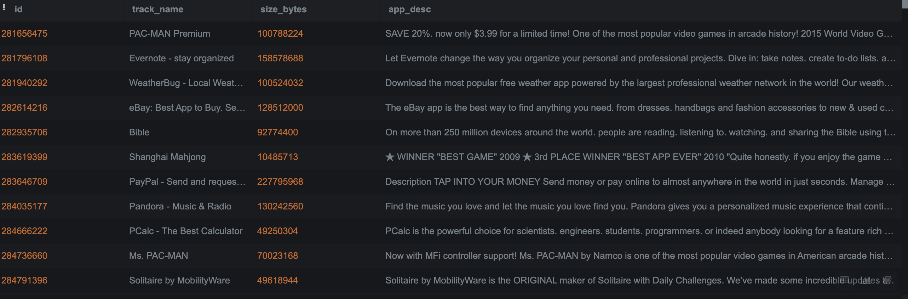<!-- -->

### 3. I will check the # of unique apps in both tables 
```
SELECT COUNT(DISTINCT id) AS Unique_app_ids
FROM AppleStore

SELECT COUNT(DISTINCT id) AS Unique_app_ids
FROM applestore_description_combined
```
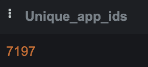<!-- -->
### 4. Check for any missing values in key fields
```
SELECT COUNT(*) AS missing_values
FROM AppleStore
WHERE track_name is NULL OR user_rating is NULL OR prime_genre

SELECT COUNT(*) AS missing_values
FROM applestore_description_combined
WHERE app_desc is NULL
```
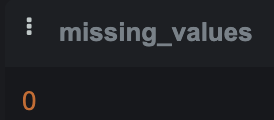<!-- -->

### 5. Find out # of apps per genre ordered by most popular genre
```
SELECT prime_genre, COUNT(*) as num_apps
FROM AppleStore
GROUP BY 1 
ORDER BY 2 DESC
```
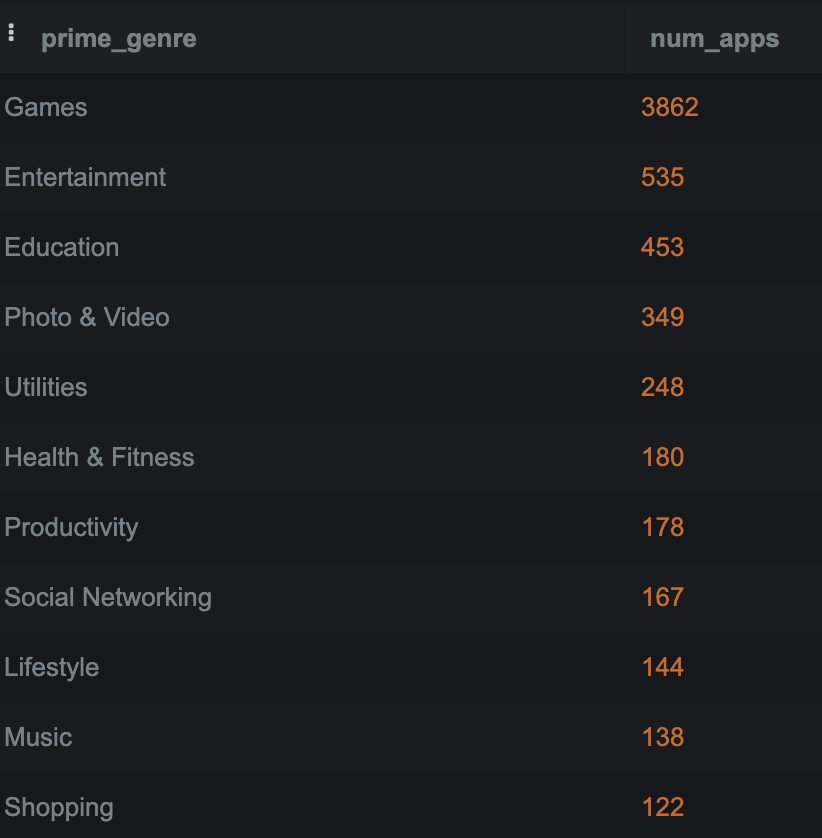<!-- -->
### 6. Get overview of apps ratings 
```
SELECT min(user_rating) AS min_rating,
       max(user_rating) AS max_rating,
       avg(user_rating) AS avg_rating
FROM AppleStore
```
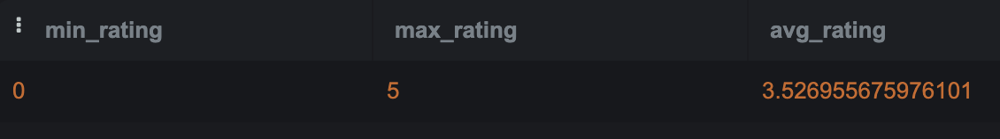<!-- -->

### 7. I will add a round function to avg. rating to two decimals to make it more readable.
```
SELECT min(user_rating) AS min_rating,
       max(user_rating) AS max_rating,
       round(avg(user_rating),2) AS avg_rating
FROM AppleStore
```
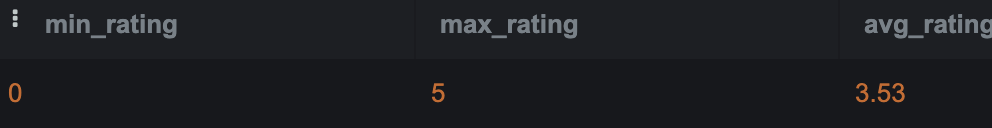<!-- -->

### 8. Determine whether paid apps have higher ratings than free apps
```
SELECT CASE
      WHEN price > 0 THEN 'Paid'
      ELSE 'Free'
      END AS app_type,
      round(avg(user_rating),2) as avg_rating
FROM AppleStore
GROUP BY 1
```
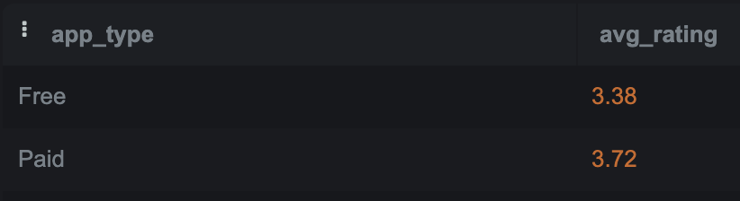<!-- -->

### 9. Check if apps with more supported languages have higher ratings
```
SELECT CASE
       WHEN lang_num < 10 THEN 'less than 10'
       WHEN lang_num BETWEEN 10 AND 30 THEN 'between 10 30'
       ELSE 'greater than 30'
       END AS num_of_languages,
       round(avg(user_rating),2) AS avg_rating
FROM AppleStore
GROUP BY 1
ORDER BY 2 DESC
```
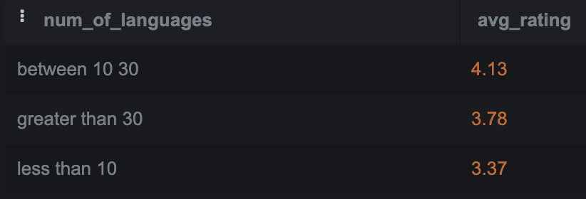<!-- -->`

### 10. Top 10 genres with highest rating
```
SELECT prime_genre,
       round(avg(user_rating),2) as avg_rating
FROM AppleStore 
GROUP BY 1
ORDER BY 2 DESC
LIMIT 10
```
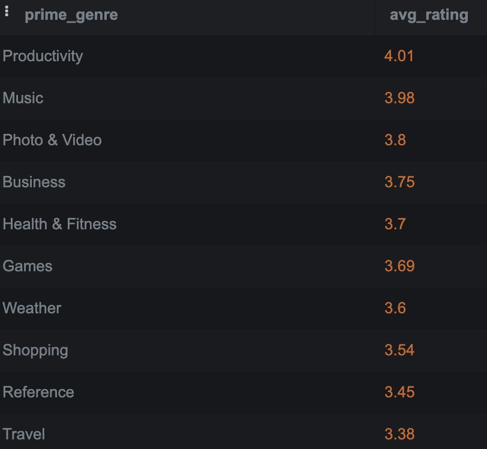<!-- -->

### 11.Top 10 genres with lowest rating
```
SELECT prime_genre,
       round(avg(user_rating),2) as avg_rating
FROM AppleStore 
GROUP BY 1
ORDER BY 2 ASC
LIMIT 10
```
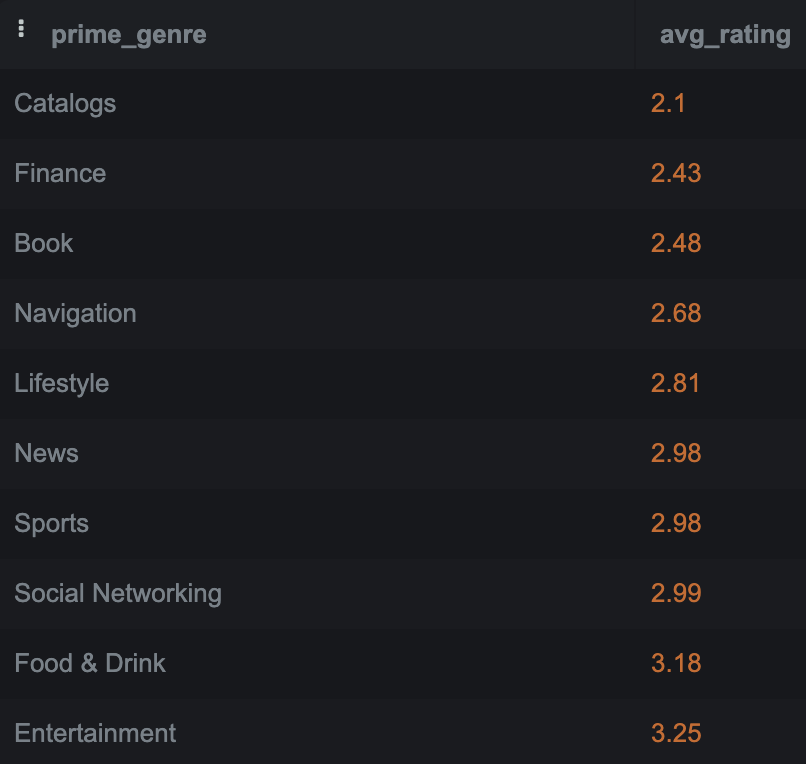<!-- -->

### 12. Check if there is a correlation between length of app desc. and user rating.
```
SELECT CASE
     WHEN length(b.app_desc) <500 THEN 'Short'
     WHEN length(b.app_desc) BETWEEN 500 AND 1000 THEN 'Medium'
     ELSE 'Long'
     END AS description_length,
     round(avg(a.user_rating),2) as average_rating
FROM AppleStore AS a
JOIN applestore_description_combined AS b 
ON a.id=b.id
GROUP BY 1
ORDER BY 2 DESC
```
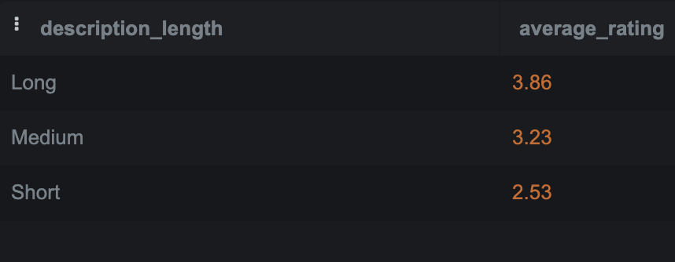<!-- -->

### 13. Check the top-rated apps for each genre
```
SELECT prime_genre,
      track_name,
      user_rating
FROM (
     SELECT
     prime_genre,
     track_name,
     user_rating,
     RANK() OVER(PARTITION BY prime_genre order BY user_rating DESC, rating_count_tot DESC) AS Rank
     FROM
     AppleStore
     ) AS a
 WHERE
 a.rank=1
```
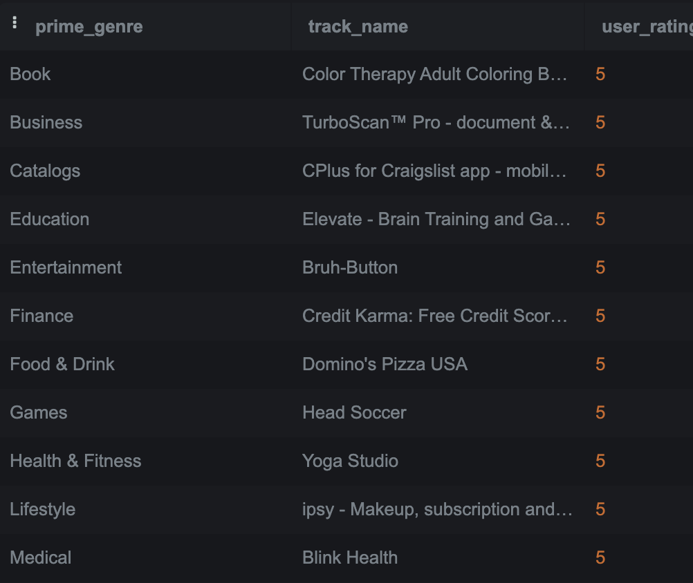<!-- -->

### 14. Checking to see the average price of each app
```
SELECT (ROUND(avg(price),2)||' '||currency) as avg_price,
       ROUND(avg(user_rating),2) AS avg_user_rating
FROM AppleStore
```
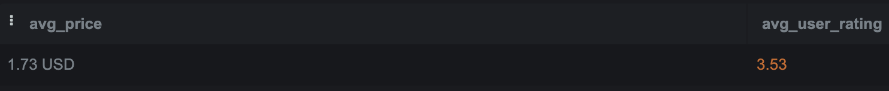<!-- -->

## Final Recommendations
1. The games category is the most popular having almost 6 times more than the 2nd most popular which is entertainment. This suggests that the category is over saturated but also suggests high user demand. This option would be a safe option to get high user engagement due to high user demand in category.
2. When Jerry develops an App he should aim to have 10 to 30 languages as these apps have better ratings.
3. There is an opportunity in finance and catalogs categories as they have the lowest user ratings. This suggest that the apps are not meeting the users need and if Jerry is able to meet the users need there is a potential of high user_ratings and market penetration
4. Jerry should not make his app free but set a price as apps that are not free having better ratings
5. Jerry should make Apps with longer description as they have better ratings as there is a positive correlation between the two. Which means that users like to read what the app is about before they download.
6. The average rating of all the apps are 3.5 so Jerry should aim for a user rating above 3.5 to stand out from the crowd.
7. The average price of an app is 1.73 USD Jerry should set his app price within this range.
